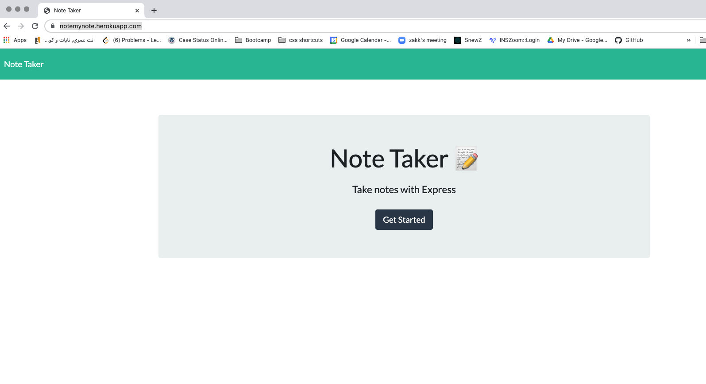

# A Note to Take
## Table of Contents
[License](#license)

[Description](#description)

[Installation](#installation)

[Usage](#usage)

[Contributing](#contributing)

[Test](#test)

[Questions](#questions)
## License
This project is covered by the MIT license

## Description
This app helps a user take new notes and keep track of existing notes. 
## Installation
to install run npm i 
## Usage
to run the server run npm start 
You can also review the deployed version [here](https://notemynote.herokuapp.com/)

## Contributing
contact Ray Ashir ray.dev.seng@gmail.com
## Test
n/a
## Questions
[Github rashir01](https://github.com/rashir01)

Email: ray.dev.seng@gmail.com
